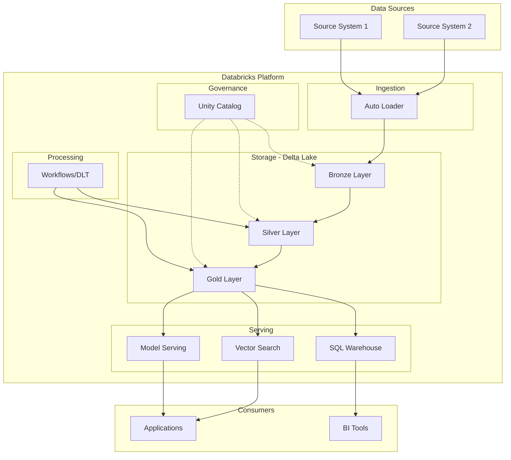

# /asq-architecture - Solution Architecture Design

Design a Databricks solution architecture for an ASQ engagement using installed skills for up-to-date patterns, generate a mermaid diagram, and document design decisions in the customer note.

## Usage

```
/asq-architecture AR-000106904
```

## Workflow

### 0. Resolve Paths

Read `~/.claude/CLAUDE.md` and look for an `## ASQ Notes Configuration` section. If found, use those paths. Otherwise use defaults:
- `ASQ_NOTES_ROOT`: `~/asq-notes`
- `CUSTOMERS_DIR`: `customers/`

### 1. Parse AR ID

Extract the AR ID from the argument. Accept formats: `AR-000106904` or `000106904` (auto-prefix AR-).

### 2. Find and Read Customer Note

Use Glob to find `customer-*-AR-{ID}.md` in `{ASQ_NOTES_ROOT}/{CUSTOMERS_DIR}`.

If not found, tell the user:
> No customer note found for {AR ID}. Run `/asq-intake {AR ID}` first.

Read the full note including:
- ASQ Summary (business context, technical environment, project scope)
- Research Findings (if present from /asq-research)
- Technical Issues & Solutions
- Problem Statements
- Open Items

### 3. Extract Architecture Requirements

From the note content, identify:
- **Cloud provider** (AWS, Azure, GCP)
- **Databricks services** needed (Unity Catalog, Delta Lake, Vector Search, MLflow, Workflows, SQL Warehouses, Lakebase, etc.)
- **Data sources** and ingestion patterns
- **Data scale** (volume, velocity, variety)
- **Security requirements** (RBAC, row-level security, encryption, compliance)
- **Integration points** (external systems, APIs, downstream consumers)
- **Performance requirements** (latency SLAs, QPS, throughput)
- **User patterns** (number of users, concurrent access, query patterns)

### 4. Discover Available Skills

Build a catalog of skills to inform the architecture design.

#### 4a. Identify Installed Skills

Check the current session's available skills list (provided in system context each turn). These are already installed and can be invoked directly. Look for skills relevant to the identified architecture requirements — for example:
- `fe-databricks-tools:databricks-lakebase` → Lakebase database patterns
- `fe-databricks-tools:databricks-query` → SQL query execution
- `fe-databricks-tools:databricks-apps` → Databricks Apps with Foundation Model API
- `fe-databricks-tools:databricks-lineage` → Unity Catalog lineage
- `fe-databricks-tools:databricks-data-generation` → synthetic data for testing
- `fe-workflows:databricks-sizing` → compute sizing estimates
- `fe-workflows:performance-tuning` → performance optimization
- `fe-workflows:fe-architecture-diagram` → professional architecture diagrams
- `databricks-docs` → general Databricks documentation lookup

#### 4b. Scan Marketplace for Additional Skills

Read `~/.claude/plugins/known_marketplaces.json` to get all registered marketplaces. For each marketplace entry:

1. Get the `installLocation` path
2. Read `{installLocation}/.claude-plugin/marketplace.json`
3. For each plugin listed, note the plugin `name`, `description`, and `category`

Cross-reference the marketplace plugins against the architecture requirements. Identify plugins that are **not currently installed** but would be relevant. For example:
- `brickify` → if the customer needs code migration
- `databricks-ai-dev-kit` → if they need ML/AI agent development patterns
- `lakeflowdikes` → if they need Lakeflow pipeline governance
- `data-platform-ops` → if they need infrastructure/operations patterns
- `databricks-cli-mastery` → if CLI automation is relevant

#### 4c. Look Up Current Documentation

For each Databricks service identified in the requirements, use the `databricks-docs` skill (if installed) or WebSearch to verify:
- The service is current and not deprecated
- Latest API patterns and best practices
- Any new capabilities relevant to the customer's use case

This ensures the architecture uses **up-to-date patterns** rather than stale assumptions.

### 5. Design Solution Architecture

Design the solution informed by the skills and documentation gathered in Step 4. For each architectural layer, prefer patterns validated by installed skills over generic assumptions.

Architectural layers to address (include only those relevant to the customer):

1. **Data Ingestion Layer**: How data enters the platform (Auto Loader, Lakeflow, Kafka, API ingestion, batch uploads)
2. **Storage Layer**: Delta Lake organization (medallion or domain-based), Unity Catalog structure, Lakebase for operational data
3. **Processing Layer**: Workflows, DLT/Lakeflow pipelines, streaming vs batch
4. **Serving Layer**: SQL Warehouses, Model Serving, Vector Search endpoints, Feature Store, Databricks Apps
5. **AI/ML Layer**: MLflow, model training, Foundation Model APIs, inference endpoints, RAG patterns, AI agents
6. **Governance Layer**: Unity Catalog, lineage, access controls, audit
7. **Integration Layer**: External system connections, APIs, data sharing

For each layer, document:
- Components selected and why
- **Which skill informed this choice** (if applicable)
- Configuration recommendations
- Sizing guidance (where applicable)
- Key design decisions with rationale

### 6. Generate Mermaid Diagram

Create a mermaid diagram showing the architecture. The diagram will be embedded directly in the customer note's Architecture section (not saved as a separate file).

Use a flowchart (graph TD or graph LR) with clear grouping. Customize based on the actual requirements — do NOT use a generic template. The diagram should reflect only the components identified for this specific customer.

Example structure (adapt to the actual design):



### 7. Add Architecture Section to Customer Note

Use the Edit tool to add an `## Architecture` section to the customer note. Place it after Research Findings (if present) or after ASQ Summary.

```markdown
## Architecture

> Designed on {YYYY-MM-DD}

### Solution Overview
{1-2 paragraph summary of the architecture approach}

### Key Design Decisions

| Decision | Choice | Rationale |
|----------|--------|-----------|
| {decision 1} | {choice} | {why} |
| {decision 2} | {choice} | {why} |

### Component Details

#### {Layer/Component 1}
- **Service**: {Databricks service}
- **Configuration**: {key settings}
- **Sizing**: {recommendations}
- **Notes**: {important considerations}

### Scalability & Performance
- {Key scalability consideration 1}
- {Key performance recommendation 1}

### Architecture Diagram

```mermaid
{mermaid diagram here — embed the full diagram from Step 6}
```

### Skills Used
Skills that informed this architecture design:
- `{skill-name}` — {how it was used}

### Recommended Skills to Install
Marketplace plugins not currently installed that would help with implementation:

| Plugin | Marketplace | Why | Install Command |
|--------|-------------|-----|-----------------|
| {plugin-name} | {marketplace} | {relevance} | `claude plugin install {name}@{marketplace}` |
```

### 8. Show Summary

Display to the user:
- Architecture designed for {AR ID} ({customer name})
- Key components: {list of main Databricks services}
- Design decisions: {count}
- Skills used: {list of installed skills that informed the design}
- Recommended installs: {list of marketplace plugins to install, with commands}
- Note updated with Architecture section
