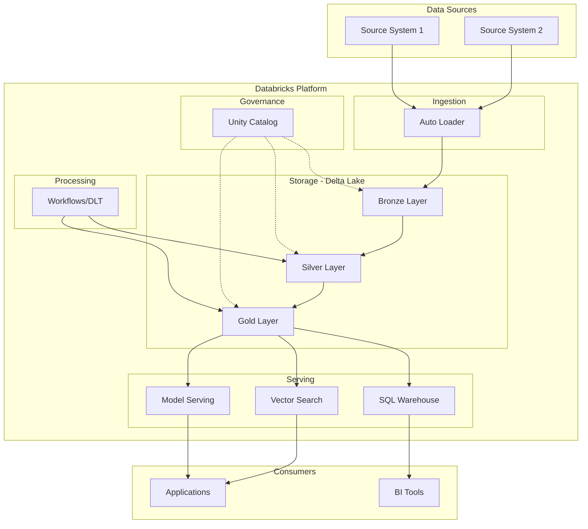

# /asq-architecture - Solution Architecture Design

Design a Databricks solution architecture for an ASQ engagement, generate a mermaid diagram, and document design decisions in the customer note.

## Usage

```
/asq-architecture AR-000106904
```

## Workflow

### 1. Parse AR ID

Extract the AR ID from the argument. Accept formats: `AR-000106904` or `000106904` (auto-prefix AR-).

### 2. Find and Read Customer Note

Use Glob to find `customer-*-AR-{ID}.md` in `~/workspace/databricks_knowledge_vault/02-customers/`.

If not found, tell the user:
> No customer note found for {AR ID}. Run `/asq-intake {AR ID}` first.

Read the full note including:
- ASQ Summary (business context, technical environment, project scope)
- Research Findings (if present from /asq-research)
- Technical Issues & Solutions
- Problem Statements
- Open Items

### 3. Extract Architecture Requirements

From the note content, identify:
- **Cloud provider** (AWS, Azure, GCP)
- **Databricks services** needed (Unity Catalog, Delta Lake, Vector Search, MLflow, Workflows, SQL Warehouses, etc.)
- **Data sources** and ingestion patterns
- **Data scale** (volume, velocity, variety)
- **Security requirements** (RBAC, row-level security, encryption, compliance)
- **Integration points** (external systems, APIs, downstream consumers)
- **Performance requirements** (latency SLAs, QPS, throughput)
- **User patterns** (number of users, concurrent access, query patterns)

### 4. Design Solution Architecture

Design a solution following Databricks best practices:

1. **Data Ingestion Layer**: How data enters the platform (Auto Loader, Kafka, API ingestion, batch uploads)
2. **Storage Layer**: Delta Lake organization (bronze/silver/gold medallion or domain-based), Unity Catalog structure
3. **Processing Layer**: Workflows, DLT pipelines, streaming vs batch
4. **Serving Layer**: SQL Warehouses, Model Serving, Vector Search endpoints, Feature Store
5. **AI/ML Layer**: MLflow, model training, inference endpoints, RAG patterns
6. **Governance Layer**: Unity Catalog, lineage, access controls, audit
7. **Integration Layer**: External system connections, APIs, data sharing

For each layer, document:
- Components selected and why
- Configuration recommendations
- Sizing guidance (where applicable)
- Key design decisions with rationale

### 5. Generate Mermaid Diagram

Create a mermaid diagram showing the architecture. Extract the company code from the filename (e.g., TRV from customer-TRV-AR-000106904.md).

Save as `customer-{CODE}-AR-{ID}-architecture.mermaid` in the same directory as the customer note (`~/workspace/databricks_knowledge_vault/02-customers/`).

Use a flowchart (graph TD or graph LR) with clear grouping:



Customize the diagram based on the actual requirements. Include:
- All relevant data sources
- Specific Databricks services (not generic boxes)
- Data flow direction with arrows
- Grouping by logical layer
- External integrations

### 6. Add Architecture Section to Customer Note

Use the Edit tool to add an `## Architecture` section to the customer note. Place it after Research Findings (if present) or after ASQ Summary.

```markdown
## Architecture

> Designed on {YYYY-MM-DD}

### Solution Overview
{1-2 paragraph summary of the architecture approach}

### Key Design Decisions

| Decision | Choice | Rationale |
|----------|--------|-----------|
| {decision 1} | {choice} | {why} |
| {decision 2} | {choice} | {why} |

### Component Details

#### {Layer/Component 1}
- **Service**: {Databricks service}
- **Configuration**: {key settings}
- **Sizing**: {recommendations}
- **Notes**: {important considerations}

#### {Layer/Component 2}
...

### Scalability & Performance
- {Key scalability consideration 1}
- {Key performance recommendation 1}
- {Growth path and future considerations}

### Architecture Diagram
See: [[customer-{CODE}-AR-{ID}-architecture.mermaid]]
```

### 7. Show Summary

Display to the user:
- Architecture designed for {AR ID} ({customer name})
- Diagram saved to: {mermaid file path}
- Key components: {list of main Databricks services}
- Design decisions: {count}
- Note updated with Architecture section
- Remind user to review the mermaid diagram in Obsidian (rendered with mermaid plugin)
